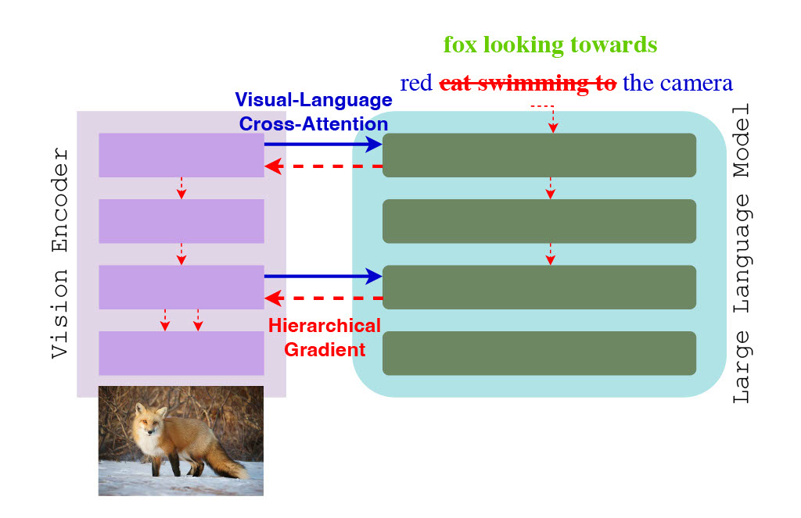

<div align="center">

# Hierarchical Pre-Training of Vision Encoders with Large Language Model

[](https://openaccess.thecvf.com/content/CVPR2026W/MMFM5/papers/Lee_Hierarchical_Pre-Training_of_Vision_Encoders_with_Large_Language_Model_CVPRW_2026_paper.pdf)
[](https://arxiv.org/abs/2604.00086)
[](https://eugenelet.github.io/HIVE-Project/#)



</div>

This is the official repository for the CVPR 2026 paper, **Hierarchical Pre-Training of Vision Encoders with Large Language Model** (HIVE).

---

## Install

1. Install the local package:

```bash
conda create -n hive python=3.11 -y
conda activate hive
pip install -e .

```

2. Install other dependencies. Key required packages include:

* [PyTorch](https://github.com/pytorch/pytorch)
* [Accelerate](https://github.com/huggingface/accelerate)
* [DeepSpeed](https://github.com/deepspeedai/DeepSpeed)
* [Transformers](https://github.com/huggingface/transformers)
* [Flash-attention](https://github.com/Dao-AILab/flash-attention)

---

## Train

All training scripts are provided in the `scripts/train` folder. We use the language model [MobileLLM](https://github.com/facebookresearch/MobileLLM) to assist in vision encoder training.

* **Vision Encoder Training:** Training is conducted in 3 stages:
1. **Connector Pretraining**
2. **Modality Adaptation**
3. **Vision Finetuning**


* **VLM Training:** We follow the [LLaVA](https://github.com/haotian-liu/LLaVA) training method. Training is conducted in 2 stages:
1. **Pretrain** (feature alignment)
2. **Visual Instruction Tuning**


* **Classifier Training:** We adopt an attentive probe classifier and a linear probe classifier with a frozen vision encoder backbone.

---

## Datasets

### Vision Encoder Training

We use the CC3M dataset. We utilize synthetic captions for the VQA task and alt-text for the classification task. The dataset is provided in the Hugging Face repository:

* [CC3M_synthetic](https://huggingface.co/datasets/timjeffrey10/CC3M_synthetic)

### VLM Training

Following the [LLaVA](https://github.com/haotian-liu/LLaVA) framework, we use the following datasets:

* **Pretrain:** [LCS-558k](https://huggingface.co/datasets/liuhaotian/LLaVA-Pretrain)
* **Instruction Finetuning:** [LLaVA-NeXT-Data](https://huggingface.co/datasets/lmms-lab/LLaVA-NeXT-Data)

---

## Evaluation

* **VQA Task:** We use [lmms-eval](https://github.com/EvolvingLMMs-Lab/lmms-eval) to evaluate the VQA task for the VLM.
* **Image Classification:** We use [ImageNet-1k](https://huggingface.co/datasets/mlx-vision/imagenet-1k) to evaluate the image classification task.

---

## Citation

If you find this work helpful or use our code in your research, please consider citing our paper:

```bibtex
@inproceedings{lee2026hierarchical,
  title={Hierarchical Pre-Training of Vision Encoders with Large Language Model},
  author={Lee, Eugene and Chang, Ting-Yu and Tsai, Jui-Huang and Diao, Jiajie and Lee, Chen-Yi},
  booktitle={Proceedings of the IEEE/CVF Conference on Computer Vision and Pattern Recognition},
  pages={7415--7424},
  year={2026}
}

```